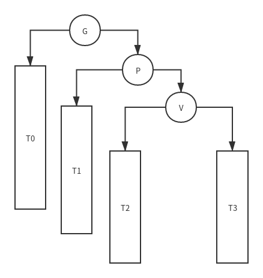
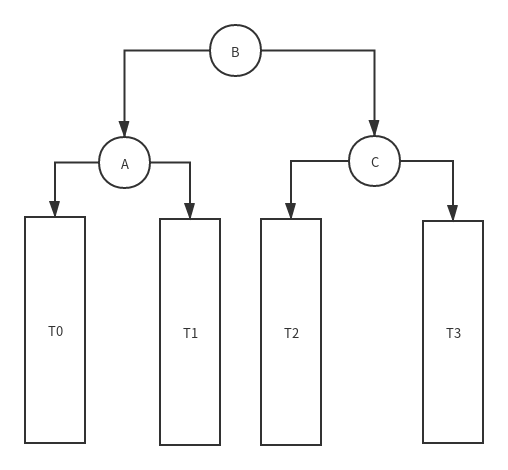

AVL 树是一种自平衡的二叉搜索树，对于它的性质和构造方法网上已经有好多文章进行过仔细的讲解，这个只记录一下在邓公的《数据结构》里面讲解的一种实现对不平衡子树的调整方法—— `3+4`  重构

## 3+4 重构

无论是 `zag` 操作



还是 `zig` 操作,以及 `zig-zag` `zag-zig` 操作

最终的结果都是变成下图所示的树状结构



只是最终成为子树的根节点已经连接方式略有不同而已。

3+4 重构，就是将旋转涉及的3个节点和4个子树进行重新连接，使之重新平衡。就像解魔方一样，通过一定的旋转方法可以将魔方复原，但将魔方拆了然后按颜色组装也可以复原魔方，3+4 重构就是那个拆了组装的方法。

```c++
    avlNode<T>* avlTree<T>::connect34(avlNode<T>*a,avlNode<T>*b,avlNode<T>*c,
                                      avlNode<T>*T0,avlNode<T>*T1,avlNode<T>*T2,avlNode<T>*T3){
        a->left = T0;
        a->right = T1;
        c->left = T2;
        c->right = T3;
        b->left = a;
        b->right = c;
        return b;
    }
```

单独对于每一种旋转操作,有下面操作，其中T0-T3是从左至右的4个子树。
- zag

```c++
connect34(g,p,v,T0,T1,T2,T3);
```

- zig

```c++
connect34(v,p,g,T0,T1,T2,T3);
```

- zag-zig

```c++
connect34(p,v,g,T0,T1,T2,T3);
```

- zig-zag

```c++
connect34(g,v,p,T0,T1,T2,T3);
```


